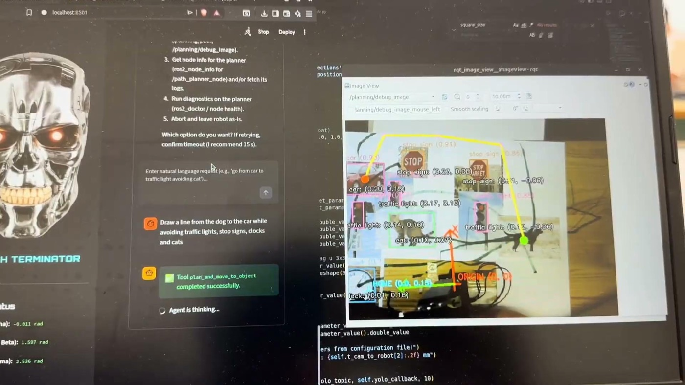
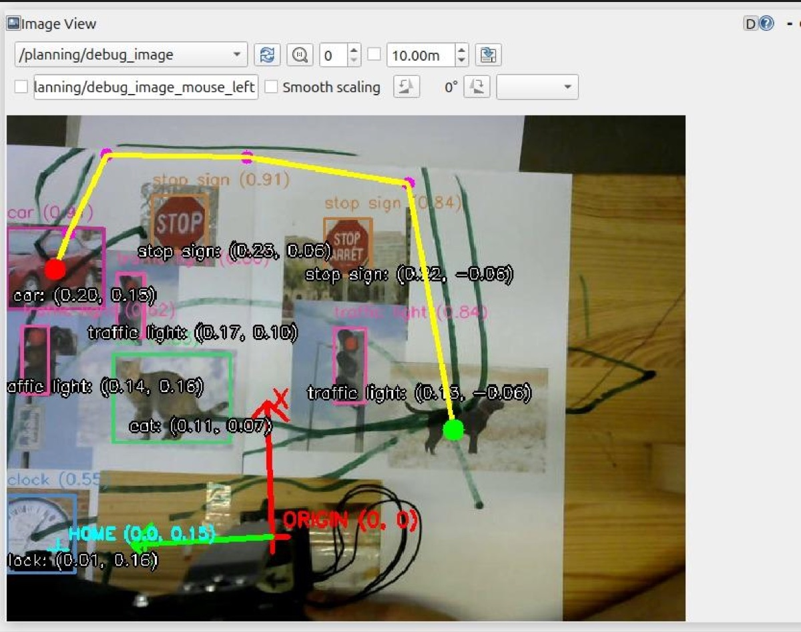
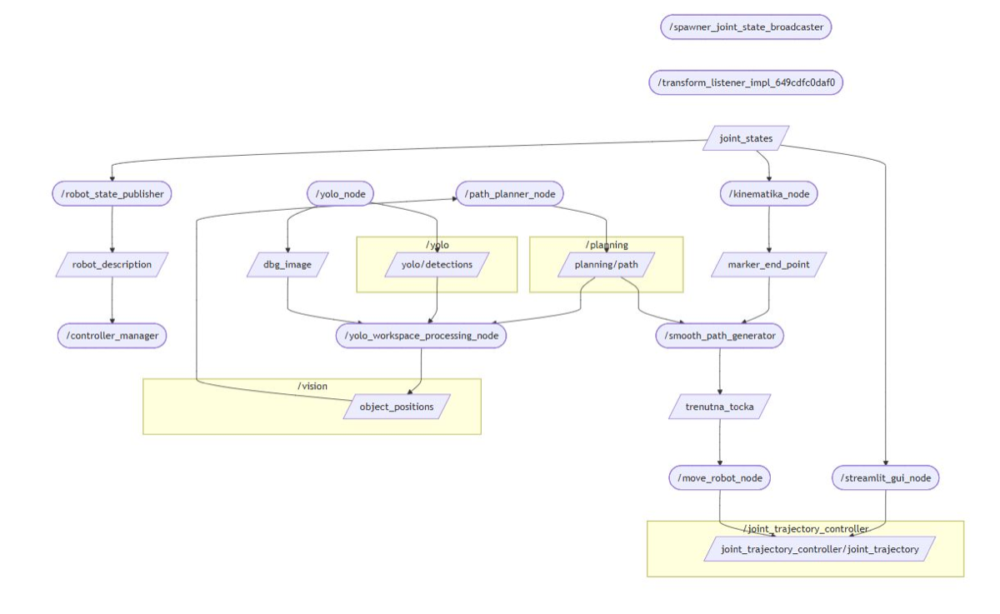
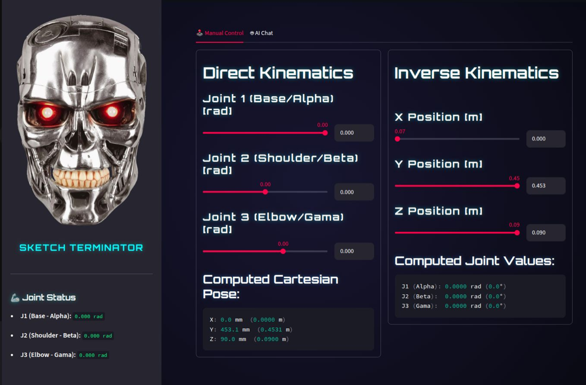
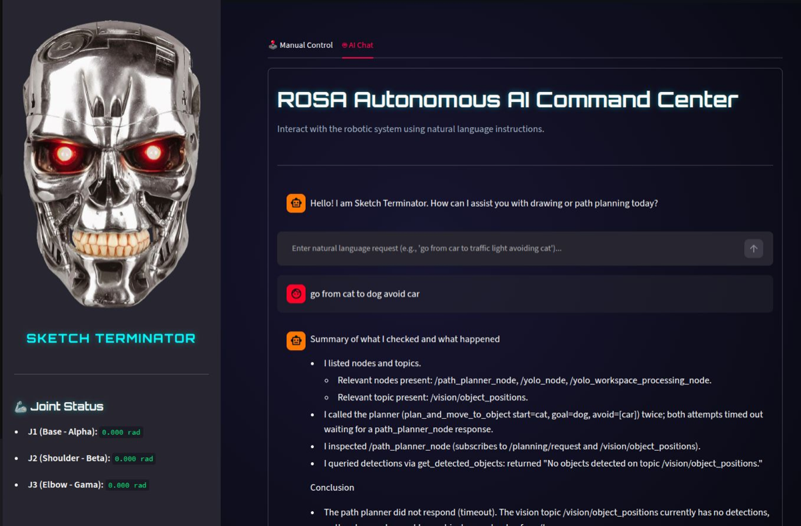

# Sketch Terminator

A 3-DOF robot arm that draws lines between objects it can see.

Point a webcam at a sheet of paper with some objects on it, tell the robot
*"draw a line from the car to the traffic light, but avoid the cat"* in plain
English, and it finds them, plans a path that goes around the cat, and draws it
with a marker.



---

## What it does

1. **Sees.** A YOLO model detects objects in the camera image, and a
   calibrated projection turns each detection's pixels into real coordinates
   in the robot's own frame.
2. **Plans.** A visibility graph plus A\* finds the shortest path between two
   objects that stays clear of the ones you asked it to avoid.
3. **Draws.** The path is resampled into a constant-speed stream of points,
   inverse kinematics turns each one into joint angles, and the arm draws it,
   lifting the marker for the approach and retreat.
4. **Listens.** An LLM agent ([ROSA](https://github.com/nasa-jpl/rosa)) sits on
   top with tools for each of the above, so the whole thing can be driven
   conversationally.



*The planner's debug view: detections in pink, the planned path in yellow,
the robot's origin and axes in red and green.*

## The robot

| | |
|---|---|
| **Joints** | 3: base rotation, shoulder, elbow |
| **Servos** | Dynamixel XL430-W250, IDs 11/12/13 on one 1 Mbps TTL bus |
| **Reach** | ~45 cm (200 mm + 253 mm links) |
| **Drawing speed** | 10 cm/s |
| **Camera** | Any UVC webcam, fixed overhead, 640 × 480 |
| **End effector** | Spring-loaded marker holder, so no fourth axis is needed |
| **Structure** | 3D-printed links on a plywood base |

Full bill of materials, printable files and assembly notes:
**[`hardware/README.md`](hardware/README.md)**

## Architecture



The pipeline is a straight line, and each stage is a separate ROS 2 node:

```
camera ──► yolo_node ──► yolo_workspace_processing_node ──► path_planner_node
                                    │                              │
                                    │  /vision/object_positions     │ /planning/path
                                    ▼                              ▼
                                  (JSON)                 generate_smooth_path
                                                                   │ /current_point
                                                                   ▼
kinematics_node ◄── /joint_states ── controllers ◄── move_robot_node
      │                                                    (inverse kinematics)
      └──► /marker_end_point  (start pose for the path generator)
```

| Node | File | Job |
|---|---|---|
| `yolo_node` | [`yolo_node.py`](sketch_terminator/yolo_node.py) | Runs YOLO on the camera stream. |
| `yolo_workspace_processing_node` | [`yolo_workspace_processing_node.py`](sketch_terminator/yolo_workspace_processing_node.py) | Projects detections onto the paper plane; draws the debug overlay. |
| `path_planner_node` | [`path_planner_node.py`](sketch_terminator/path_planner_node.py) | ROS wrapper around the planner. |
| *(library)* | [`visibility_graph.py`](sketch_terminator/visibility_graph.py) | The actual planning: visibility graph + A\*. No ROS, runs standalone. |
| `smooth_path_generator` | [`generate_smooth_path.py`](sketch_terminator/generate_smooth_path.py) | Resamples the path at constant speed; adds pen-up approach and retreat. |
| `move_robot_node` | [`move_robot.py`](sketch_terminator/move_robot.py) | Inverse kinematics → joint trajectories. |
| `kinematics_node` | [`kinematics_node.py`](sketch_terminator/kinematics_node.py) | Forward kinematics from measured joint angles. |
| *(library)* | [`kinematics.py`](sketch_terminator/kinematics.py) | The arm's geometry and joint limits, in one place. |
| `agent_node` | [`agent_node.py`](sketch_terminator/agent_node.py) | The LLM agent, over ROS topics. |
| *(library)* | [`tools.py`](sketch_terminator/tools.py) | The tools the agent can call. |
| *(app)* | [`gui/dashboard.py`](gui/dashboard.py) | Streamlit control panel. |

Both pure-logic modules check themselves, with no test framework needed:

```bash
python3 sketch_terminator/kinematics.py        # IK/DK round-trip
python3 sketch_terminator/visibility_graph.py  # planner geometry
```

## The interface



The Streamlit dashboard has two tabs. **Manual Control** puts joint sliders
next to Cartesian sliders. Move either and the other follows, and the arm goes
with them. Poses that would drive the marker through the paper are refused.



**AI Chat** talks to the ROSA agent, streaming its reasoning and showing which
tool it is running.

---

## Setup

### Prerequisites

- **Ubuntu 24.04** with **ROS 2 Jazzy** ([install guide](https://docs.ros.org/en/jazzy/Installation.html))
- An NVIDIA GPU is recommended for YOLO; it falls back to CPU automatically, just slowly.

### 1. ROS dependencies

```bash
sudo apt update && sudo apt install -y \
  ros-jazzy-ros2-control ros-jazzy-ros2-controllers \
  ros-jazzy-usb-cam ros-jazzy-camera-calibration \
  ros-jazzy-cv-bridge ros-jazzy-xacro ros-jazzy-rviz2 \
  python3-colcon-common-extensions
```

The Dynamixel hardware interface may or may not have a binary release for your
distro. Try apt first, and clone it into your workspace if that comes up empty:

```bash
sudo apt install -y ros-jazzy-dynamixel-hardware \
  || git clone https://github.com/dynamixel-community/dynamixel_hardware.git \
       ~/sketch_ws/src/dynamixel_hardware
```

### 2. Workspace and source

```bash
mkdir -p ~/sketch_ws/src && cd ~/sketch_ws/src
git clone https://github.com/lukaznj/sketch-terminator.git sketch_terminator
```

`yolo_msgs` is not in the ROS index, so clone it alongside:

```bash
git clone https://github.com/mgonzs13/yolo_ros.git
```

### 3. Python dependencies

```bash
pip install ultralytics streamlit python-dotenv rich \
            jpl-rosa langchain-openai
```

### 4. Build

```bash
cd ~/sketch_ws
colcon build --symlink-install
source install/setup.bash
```

Add the source line to your `~/.bashrc` so every new terminal has it.

### 5. API key

The LLM agent needs an OpenAI key. Everything else runs without one.

```bash
cd ~/sketch_ws/src/sketch_terminator
cp config/.env.example config/.env
# edit config/.env and paste your key
```

`config/.env` is gitignored. Do not commit it.

### 6. Hardware

- Set the servo IDs to **11**, **12**, **13** at **1 Mbps** with Dynamixel
  Wizard, before assembling the arm. See
  [`hardware/README.md`](hardware/README.md).
- Give yourself access to the serial port:
  ```bash
  sudo usermod -aG dialout $USER   # log out and back in
  ```
- Check which device the adapter and the camera came up as, and update
  [`urdf/sketch_terminator.ros2_control.xacro`](urdf/sketch_terminator.ros2_control.xacro)
  (`usb_port`) and [`config/camera_params.yaml`](config/camera_params.yaml)
  (`video_device`) if they are not `/dev/ttyUSB0` and `/dev/video0`:
  ```bash
  ls /dev/serial/by-id/
  v4l2-ctl --list-devices
  ```

## Calibration

**Do this before expecting the arm to draw in the right place.** Without it,
the vision pipeline has no idea where the camera is, and every position it
reports is wrong. Redo it whenever the camera moves.

Print a **9 × 7 inner corner** checkerboard, measure one square, and put the
real numbers in [`config/calib_config.yaml`](config/calib_config.yaml).

**Step 1, intrinsics** (lens geometry and distortion):

```bash
ros2 launch sketch_terminator camera_calib.launch.py
```

Move the board around the frame until all four sample bars fill up, click
**CALIBRATE**, then **SAVE**. Copy the resulting values into
[`config/camera_calibration_params.yaml`](config/camera_calibration_params.yaml).

**Step 2, extrinsics** (where the camera is, relative to the robot):

```bash
ros2 launch sketch_terminator camera_world.launch.py
```

Tape the board flat in view, measure its offset from the base of the arm, and
put those offsets in `calib_config.yaml`. The node prints a 4 × 4 transform;
copy its rotation into `R_cam_to_robot` and its translation (**in
millimetres**, so metres × 1000) into `t_cam_to_robot`, both in
[`config/vision_config.yaml`](config/vision_config.yaml).

**Step 3, check it.** Put a red marker at a spot you have measured and confirm
the position the node prints matches. If everything is off by a consistent
amount, trim `offset_x_m` / `offset_y_m` in `vision_config.yaml` rather than
redoing the transform.

## Running it

Everything at once, meaning hardware, vision, planning, RViz and the dashboard:

```bash
ros2 launch sketch_terminator master_robot.launch.py
```

Then open **http://localhost:8501**.

Vision and planning only, with no motors powered:

```bash
ros2 launch sketch_terminator vision.launch.py
```

To watch what the vision pipeline sees:

```bash
ros2 run rqt_image_view rqt_image_view /planning/debug_image
```

You can also drive it from the command line, without the GUI:

```bash
ros2 topic pub --once /planning/request std_msgs/String \
  '{data: "{\"start_class\": \"car\", \"goal_class\": \"traffic light\", \"avoid_classes\": [\"cat\"]}"}'
```

The class names are whatever your YOLO weights were trained on. The defaults
are the 80 COCO classes, which is why the demo uses cars, cats and traffic
lights.

## Troubleshooting

| Symptom | Cause |
|---|---|
| Arm does not move, no errors | The controllers spawned before the hardware was found. Check `ros2 control list_controllers`, and that the servos are powered (the U2D2 alone does not power them). |
| `Failed to open port` | Wrong `usb_port`, or you are not in the `dialout` group. |
| Arm moves to the wrong place | Calibration. Redo it, then trim `offset_x_m` / `offset_y_m`. |
| Nothing detected | Check `/dbg_image` first. Usually lighting, or objects the model was never trained on. |
| Agent times out | `agent_node` is not running, or `OPENAI_API_KEY` is missing from `config/.env`. |
| Arm jitters near its own base | Expected, because the base yaw is ill-conditioned there. `MIN_RADIUS` in `kinematics.py` keeps targets out of that region. |

## Repository layout

```
config/            camera, calibration and vision parameters
controllers/       ros2_control configuration
docs/              presentation and images
gui/               Streamlit dashboard
hardware/          printable parts, reference CAD, build guide
launch/            launch files
meshes/            STL meshes for the robot model
scripts/           camera-to-robot calibration tool
sketch_terminator/ the ROS 2 nodes
urdf/              robot model and hardware interface
```

## Documentation

The [project presentation](docs/presentation.pdf) covers the kinematics
derivation, the path planning approach and photos of the build.

## Team

Built by a five-person team for the Robotics Practicum course, 2025/2026.

## License

[Apache 2.0](LICENSE)
