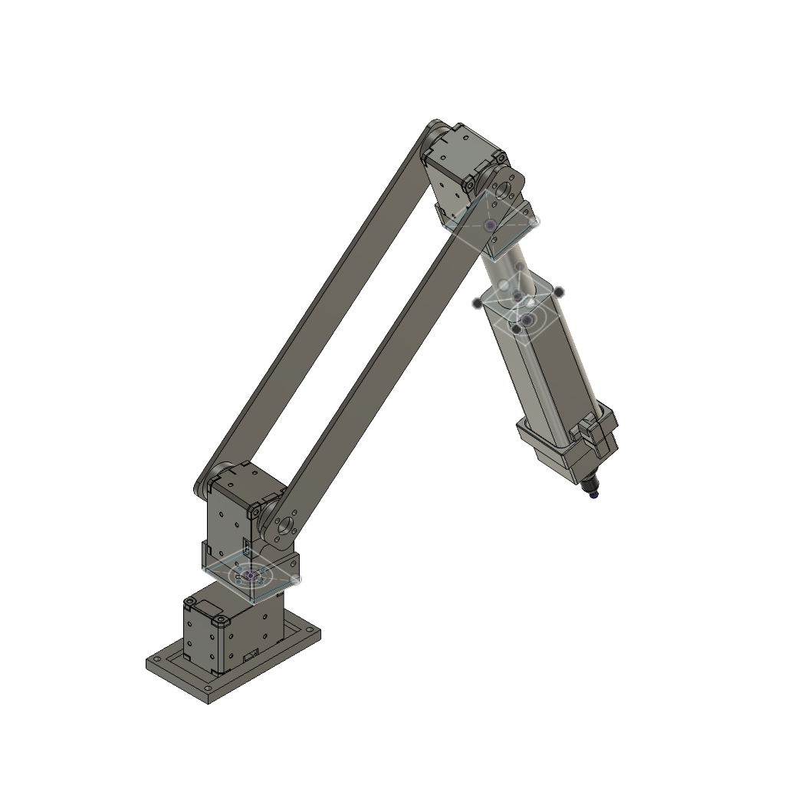
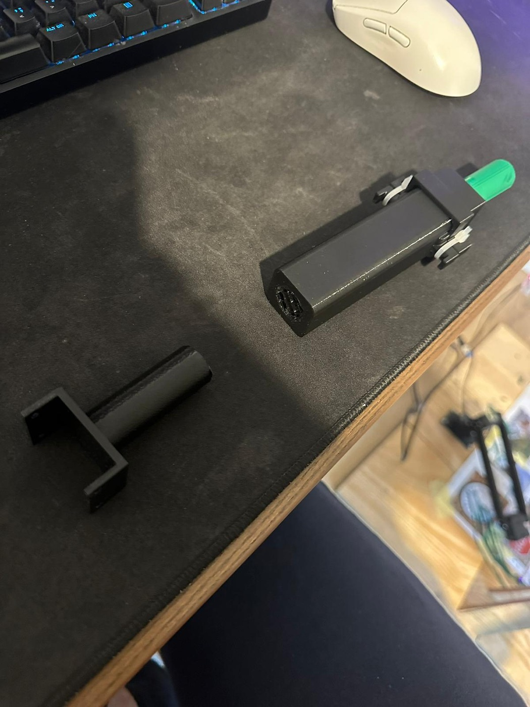
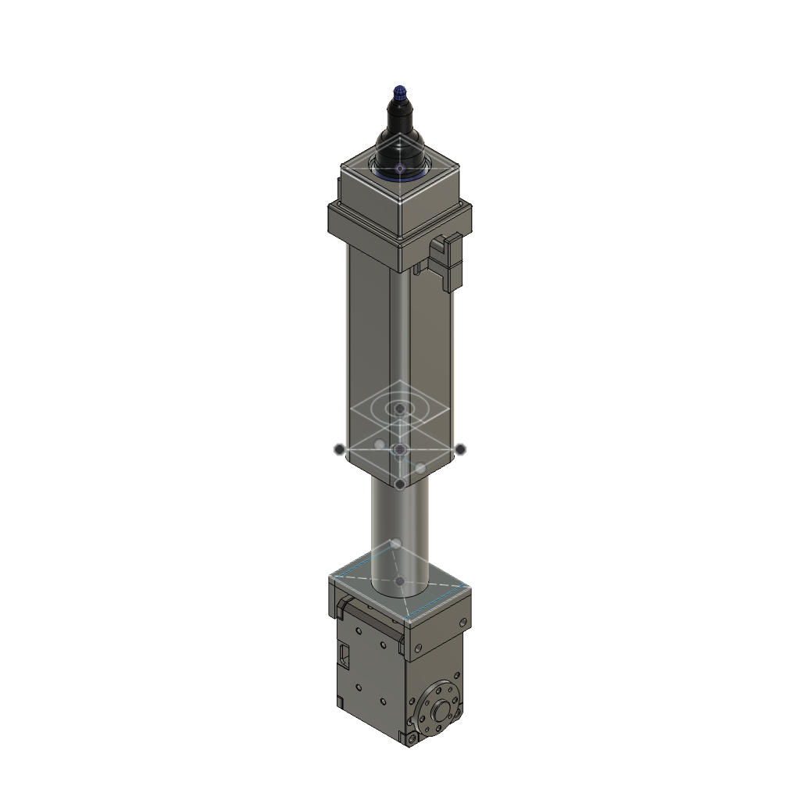
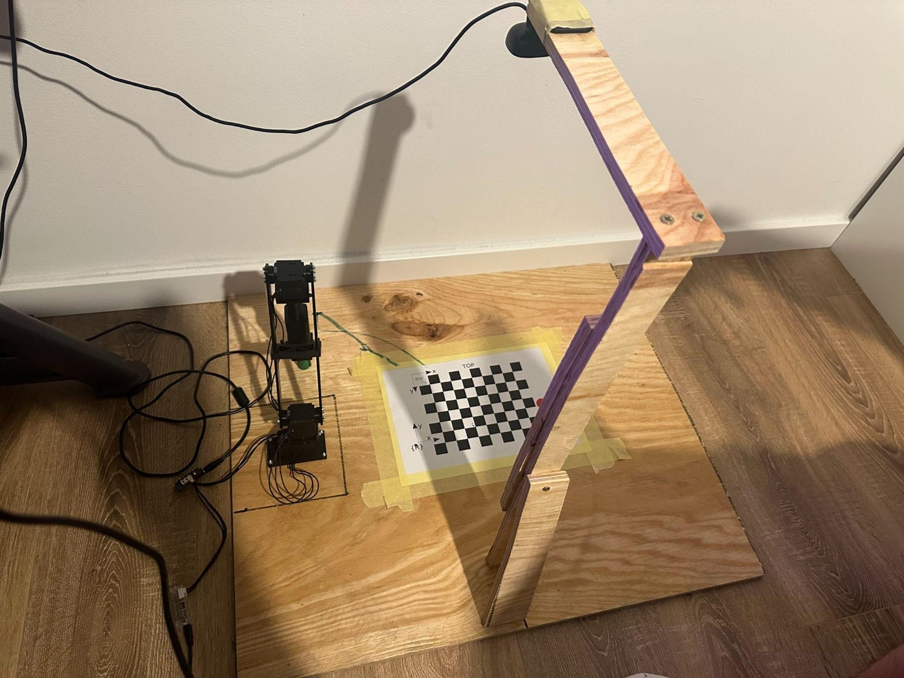

# Hardware

Everything you need to build the arm: what to buy, what to print, and how it
goes together.

## Bill of materials

| Part | Qty | Notes |
|---|---|---|
| Dynamixel **XL430-W250-T** servo | 3 | The whole arm. Any X-series servo with the same 28.5 × 46.5 × 34 mm body drops in without reprinting anything. |
| ROBOTIS **U2D2** USB adapter | 1 | Talks to the servo bus from the PC. |
| **U2D2 Power Hub** (or equivalent) | 1 | Injects 12 V into the daisy chain. |
| 12 V ≥ 2 A power supply | 1 | The XL430 is rated for 11.1 V; 12 V is the usual supply. |
| Dynamixel 3-pin TTL cables | 3–4 | One per servo plus one to the adapter. |
| **FP04-F2 / HN11-N1** style brackets | 2 | The frames that bolt onto the servo horns. Usually included with the servos. |
| M2.5 × 8 mm screws | ~20 | Servo mounting. |
| M3 × 12 mm screws + nuts | ~8 | Printed parts. |
| USB webcam (UVC, 640 × 480 or better) | 1 | Any webcam Linux exposes as `/dev/videoN`. |
| Whiteboard marker, ~18 mm barrel | 1 | Drops into the pen holder. |
| Compression spring, 9.5 × 17.5 mm | 1 | Keeps constant pressure on the paper. |
| Plywood / MDF base board | 1 | ~50 × 50 cm, plus an overhead frame for the camera. |

> The arm was built with **XL430-W250** servos. They are the cheap end of the
> X-series and are adequate here because the arm only carries a marker. They
> are plastic-geared, though, so do not add mass to the end effector without
> moving up to an XM430.

## Parts to 3D print

All files are in [`print/`](print/) as `.3mf`, exported from Fusion 360 and
ready to slice.

| File | Qty | What it is |
|---|---|---|
| [`base.3mf`](print/base.3mf) | 1 | Foot that bolts to the board and holds the base servo. |
| [`link-90-bracket.3mf`](print/link-90-bracket.3mf) | 1 | Right-angle bracket between the base servo and the shoulder servo. |
| [`long-link.3mf`](print/long-link.3mf) | 2 | The two parallel arm links. **Print two.** |
| [`pen-holder.3mf`](print/pen-holder.3mf) | 1 | Sleeve the marker slides into. |
| [`pen-holder-mount.3mf`](print/pen-holder-mount.3mf) | 1 | Carries the sleeve and bolts to the elbow servo. |
| [`pen-holder-stopper.3mf`](print/pen-holder-stopper.3mf) | 1 | Caps the sleeve and traps the spring. |

### Print settings

Nothing here is exotic. These settings were used for the parts in the photo:

| Setting | Value |
|---|---|
| Material | PLA |
| Layer height | 0.2 mm |
| Walls | 3 |
| Infill | 25 % gyroid |
| Supports | None needed; every part is oriented to print support-free |

The long links take the most load; if yours flex noticeably under the arm's own
weight, raise the wall count to 4 rather than the infill.

## Reference models

[`reference/`](reference/) holds geometry that is **not** printed. The servo
body, the marker and the spring are there so the assemblies show the real fit,
and the two assembly files are how the whole thing goes together.

| File | What it is |
|---|---|
| `full-arm-assembly.3mf` | The complete arm. Open this first to see how everything mates. |
| `pen-holder-assembly.3mf` | The end effector exploded out: sleeve, mount, stopper, spring, marker. |
| `dynamixel-xl430-w250.3mf` | Servo body, for fit checks. |
| `marker-pen.3mf` | The marker, for fit checks. |
| `compression-spring.3mf` | The spring, for fit checks. |
| `legacy-*.step` | Earlier design iterations, kept for reference. |

## The end effector

The marker is not driven up and down. The arm has only three joints, and all
three are used for positioning. Instead the marker floats inside its sleeve on
the compression spring:

- The arm drives the sleeve to **Z = 0**, slightly *into* the paper.
- The spring compresses and holds the tip down at roughly constant force.
- The stopper caps the top of the sleeve so the marker cannot be pushed out.

That means line weight stays even across the sheet without the paper having to
be perfectly flat or the Z calibration having to be perfect. It is also why
`Z_MAX` in the software is a hard limit: lifting past the shoulder pivot is
what clears the marker from the paper.

## Assembly notes

1. **Set the servo IDs first.** Connect each servo on its own with Dynamixel
   Wizard and set the IDs to **11** (shoulder), **12** (elbow) and **13**
   (base), all at **1 Mbps**. These are what
   [`urdf/sketch_terminator.ros2_control.xacro`](../urdf/sketch_terminator.ros2_control.xacro)
   expects. Doing this after assembly means taking the arm apart again.
2. **Centre every servo** (position 2048 / 180°) before bolting the horns on,
   so the mechanical zero matches the model's zero.
3. Bolt the base to the board. The arm's coordinate origin is the centre of the
   base servo's rotation axis, so measure everything else from there.
4. Daisy-chain the three servos and connect the chain to the U2D2, with the
   power hub injecting 12 V.
5. Mount the camera on an overhead frame looking straight down at the paper,
   roughly **65–70 cm** above it, with the whole drawing area in view and the
   arm's base at the edge of the frame. Anything rigid works; the one in the
   photos is scrap plywood.
6. Tape the calibration checkerboard flat inside the camera's view and measure
   its offset from the base. Those numbers go in
   [`config/calib_config.yaml`](../config/calib_config.yaml).

Once it is built, follow the calibration steps in the
[main README](../README.md#calibration), because the arm cannot draw anywhere
near the right place until the camera is calibrated.
